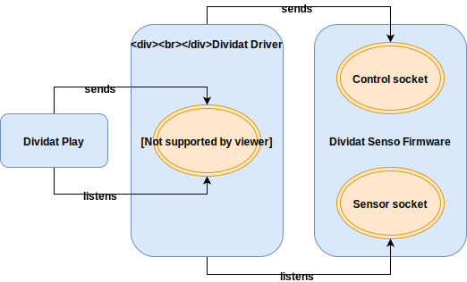

Dividat Driver is a native application developed by Dividat AG. It provides
- a general interface for communicating with Dividat Hardware;
- the Dividat Senso Driver for communication with the Dividat Senso.

## Deployment
Dividat Driver needs to be installed according to the [Installation guide](../user/installation.md).

### Updates
The Microsoft Windows version of the driver is packaged into an installer using Squirrel. Drivers installed in this way will auto-update by checking `https://dist.dividat.ch` for new versions periodically. For other operating systems, updates need to be installed manually according to the update instructions accompanied by each update.

## Interfaces

### Dividat Senso
Dividat Driver and Dividat Senso communicate via the TCP protocol ([RFC 793](https://tools.ietf.org/html/rfc793)). The firmware of the Dividat Senso has two socket servers running. A **control socket** on `SENSO_ADDRESS:55567` for transmitting control data, and a **sensor socket** on `SENSO_ADDRESS:55568` for transmitting sensor data. Dividat Driver acts as a client to these two socket servers; it listens on the sensor socket and sends data to the control socket.

### Web socket server
Dividat Driver has a web socket server running by which the Dividat Senso Driver can be accessed at `wss://localhost.dividat.com:8380/senso`. This web socket server allows external applications to communicate with the Dividat Senso Driver.

[TODO] Describe format of the input and output data.

## Use Cases
### Start Dividat Driver
Dividat Driver automatically starts when the operating system starts.

### Data is received from Dividat Senso
The data received from Dividat Senso are the sensor values of each pressure sensor on the Dividat Senso. Each time Dividat Driver receives data from Dividat Senso, the driver will decode and filter the data, and emits the result via the web socket server.

### Data is sent to Dividat Senso Driver
If motor or LED data is sent to the web socket server, the driver will code the data in the format specified by the Dividat Senso firmware and forward them to the Dividat Senso via it's control socket.

## Internationalization
The driver is only available in English.

## Security

### SSL
The server encrypts traffic using a signed certificate for the host `localhost.dividat.com` (resolves to `127.0.0.1`).  
The driver needs to be accessed via hostname `localhost.dividat.com`. If not your browser will complain.

## Persistency
The driver uses a config file on the local machine for storing configuration settings.

## Configuration
- `SENSO_ADDRESS` - Stores the address of the Dividat Senso. It's value can be set using the web socket server. Default value: `169.254.1.10`.

## Logging
A log file is written to:  
on Linux: `~/.config/Dividat Driver/log.log`  
on OS X: `~/Library/Logs/Dividat Driver/log.log`  
on Windows: `%USERPROFILE%/AppData/Roaming/Dividat Driver/log.log`  

## Build management
## Design decisions
## Quality
### Testability
### Plausibility and Validity Checks
